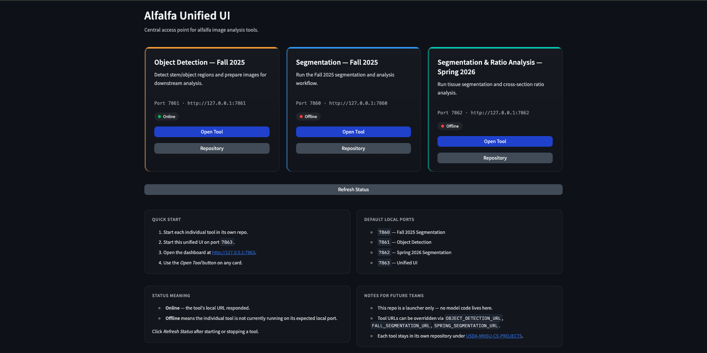

# Alfalfa Unified UI

This repository provides a centralized interface for accessing multiple alfalfa image analysis tools developed across different semesters.

## Unified UI Preview



This is the main dashboard where users can select and launch different analysis tools.

## Quick Start

## Running on Windows (Step-by-Step Setup Guide)

The instructions below are intended for users running the tools on a Windows computer. These steps assume Python and Git are not already installed.

### Step 1: Install Python

Download Python:

https://www.python.org/downloads/

During installation, make sure to check:

```text
Add python.exe to PATH
```

After installation, open **Command Prompt** and verify:

```cmd
python --version
```

You should see a Python version number.

---

### Step 2: Install Git

Download Git:

https://git-scm.com/download/win

After installation, verify:

```cmd
git --version
```

---

### Step 3: Create a workspace folder

Open **Command Prompt** and run:

```cmd
cd %USERPROFILE%
mkdir alfalfa-tools
cd alfalfa-tools
```

---

### Step 4: Clone all repositories

Run:

```cmd
git clone https://github.com/USDA-MNSU-CS-PROJECTS/segmentation-Fall2025.git
git clone https://github.com/USDA-MNSU-CS-PROJECTS/object-detection-Fall2025.git
git clone https://github.com/USDA-MNSU-CS-PROJECTS/segmentation-Spring2026.git
git clone https://github.com/USDA-MNSU-CS-PROJECTS/Alfalfa-Unified-UI.git
```

---

### Step 5: Install dependencies

Each repository uses its own virtual environment.

#### Fall 2025 Segmentation

```cmd
cd %USERPROFILE%\alfalfa-tools\segmentation-Fall2025
python -m venv .venv
.venv\Scripts\activate
pip install -r requirements.txt
```

#### Object Detection

Open another Command Prompt window:

```cmd
cd %USERPROFILE%\alfalfa-tools\object-detection-Fall2025
python -m venv .venv
.venv\Scripts\activate
pip install -r requirements.txt
```

#### Spring 2026 Segmentation

Open another Command Prompt window:

```cmd
cd %USERPROFILE%\alfalfa-tools\segmentation-Spring2026
python -m venv .venv
.venv\Scripts\activate
pip install -r requirements.txt
```

#### Unified UI

Open another Command Prompt window:

```cmd
cd %USERPROFILE%\alfalfa-tools\Alfalfa-Unified-UI
python -m venv .venv
.venv\Scripts\activate
pip install -r requirements.txt
```

---

### Step 6: Start all tools

The Unified UI expects the three tools below to be running.

Open **four Command Prompt windows**.

Tip:

Press:

```text
Windows Key → type "cmd" → press Enter
```

Repeat four times.

---

#### Window 1: Fall 2025 Segmentation

```cmd
cd %USERPROFILE%\alfalfa-tools\segmentation-Fall2025
.venv\Scripts\activate
set PORT=7860
python app.py
```

---

#### Window 2: Object Detection

```cmd
cd %USERPROFILE%\alfalfa-tools\object-detection-Fall2025
.venv\Scripts\activate
set PORT=7861
python app.py
```

---

#### Window 3: Spring 2026 Segmentation

```cmd
cd %USERPROFILE%\alfalfa-tools\segmentation-Spring2026
.venv\Scripts\activate
set PORT=7862
python app.py
```

---

#### Window 4: Unified UI

```cmd
cd %USERPROFILE%\alfalfa-tools\Alfalfa-Unified-UI
.venv\Scripts\activate
set PORT=7863
python app.py
```

Open:

```text
http://127.0.0.1:7863
```

---

### Step 7: Verify the Unified UI

After opening the Unified UI:

1. Click **Refresh Status**
2. Confirm all tools display **Online**
3. Open the desired tool from the dashboard

---

### Common Issues

#### Python is not recognized

If Windows reports:

```text
python is not recognized
```

Python was likely installed without enabling PATH. Reinstall Python and enable:

```text
Add python.exe to PATH
```

---

#### Tool appears Offline

Make sure the corresponding tool is running:

```text
Fall 2025 Segmentation → 7860
Object Detection → 7861
Spring 2026 Segmentation → 7862
Unified UI → 7863
```

Then click **Refresh Status**.

---


---

### Future Deployment Note

For long-term use, these tools can also be hosted on a centralized server or USDA computing environment. Once hosted, users would only need to access a web link instead of starting all applications locally.
## Configuration

The following environment variables override the default tool URLs without editing code:

- `OBJECT_DETECTION_URL` — defaults to `http://127.0.0.1:7861`
- `FALL_SEGMENTATION_URL` — defaults to `http://127.0.0.1:7860`
- `SPRING_SEGMENTATION_URL` — defaults to `http://127.0.0.1:7862`

The unified UI itself binds to `127.0.0.1:7863` by default. Override with the `HOST` and `PORT` environment variables if needed.

## Project Clients

- Dr. D. Jo Heuschele — Research Agronomist, USDA ARS
- Dr. Hannah Rusch — Researcher, University of Minnesota

## Notes for Future Teams

- This repo is a launcher, not a model repo.
- Do not duplicate model code here.
- Keep tools modular.
- Update ports carefully.
- Keep UI simple and maintainable.
